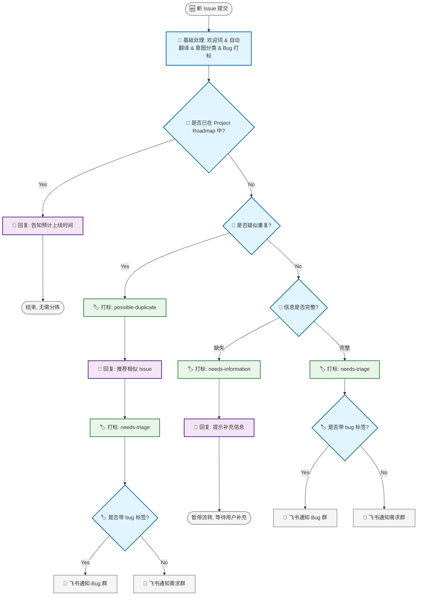
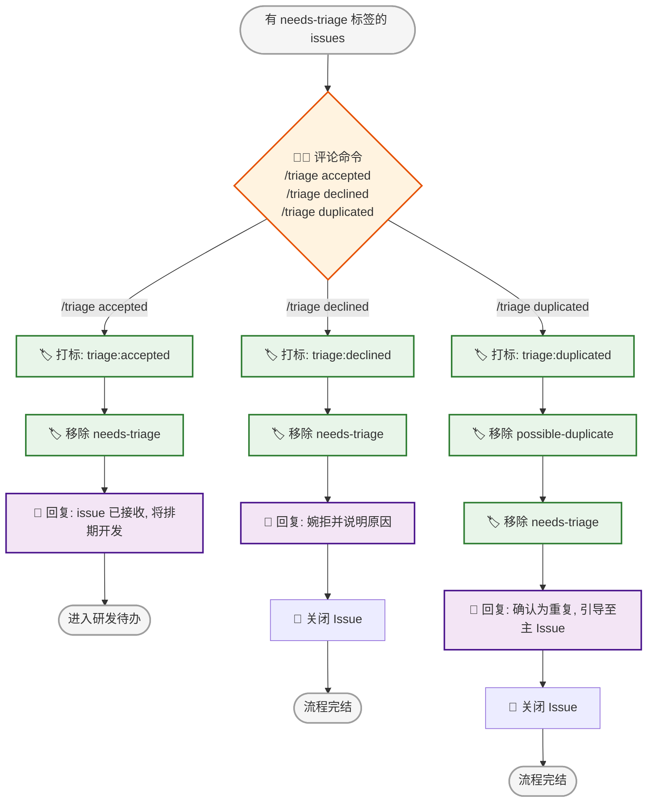
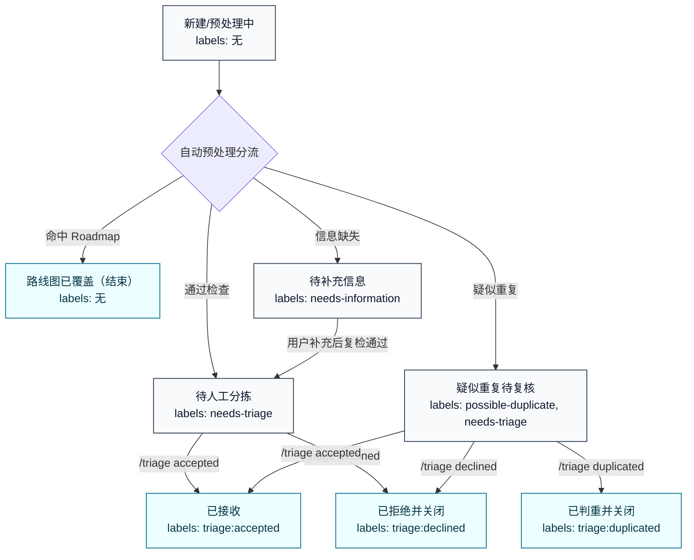

# 自动化 Issue 分拣系统

## 设计目标与核心原则

+ **单一事实来源 (Single Source of Truth)：** 所有状态、评论和决议均以 GitHub 为准，避免信息在 GitHub 和飞书之间割裂。
+ **Label 即状态机 (Labels as State Machine)：** 除 `Roadmap` 命中后“直接回复并结束”这一路径外，其余自动化动作（发送通知、自动回复、关闭 Issue）都由 GitHub Issue 的 Label 变更来触发或标识。
+ **命令优先而非手工打标：** PM 不直接手工添加 `triage:*` 标签，而是在 Issue 下通过评论命令（如 `/triage accepted`）触发自动打标与后续流程，确保操作一致、可审计、可回放。
+ **尽早降噪与拦截：** 通过自动查重和信息完整度检查，将无效或低质量的 Issue 挡在 PM 人工分拣之前。
+ **渐进式增强：** 飞书仅作为辅助通知通道，不承载复杂的审批逻辑。

## 核心状态与标签定义 (State & Labels)

系统将依赖以下标签组合来驱动整个分拣流程：

| **标签 (Label)**     | **含义与作用**                    | **添加方式** | **后续触发动作**                                   |
| -------------------- | --------------------------------- | ------------ | -------------------------------------------------- |
| `bug`                | 该 Issue 被识别为 Bug            | 🤖 自动       | 仅作为分类标签；后续飞书通知会据此发送到不同群     |
| `possible-duplicate` | 疑似重复 Issue                  | 🤖 自动       | 进入人工复核队列；同时补打 `needs-triage`          |
| `needs-information`  | 核心信息缺失（如缺复现步骤）     | 🤖 自动       | 提示用户补充并暂停流转，等待补充后再继续处理        |
| `needs-triage`       | 等待人工分拣                    | 🤖 自动       | 所有需要人工处理的 Issue 都应带此标签；飞书通知再根据是否带 `bug` 标签分群 |
| `triage:accepted`    | PM 确认接收该需求/Bug             | 👨‍💻 评论命令   | 🤖 自动移除 `needs-triage` 并回复用户               |
| `triage:declined`    | PM 拒绝处理（不采纳或不修复）     | 👨‍💻 评论命令   | 🤖 自动移除 `needs-triage`，回复婉拒文案并 Close Issue |
| `triage:duplicated`  | PM 确认该 Issue 为重复            | 👨‍💻 评论命令   | 🤖 自动移除 `needs-triage`，回复重复说明并 Close Issue |

## 整体工作流

*图例说明：*

+ 🤖 **自动检测/判断** (GitHub Actions + LLM)
+ 🏷️ **自动打标** (Automated Labeling)
+ 💬 **自动回复** (Automated Commenting)
+ 👨‍💻 **人工操作** (Manual Action)

### Phase 1: 自动预处理

### Phase 2: 人工分拣

## Issue 状态流转

下面仅从 Issue 状态视角描述流转；每个状态都标注当前应有的 labels。

